# CogniHelm

[](https://www.docker.com/)
[](https://www.python.org/)
[](https://opensource.org/licenses/Apache-2.0)
[](https://artificialintelligenceact.eu/)

CogniHelm is an enterprise-grade middleware protocol providing **Immutable Human-in-the-Loop (HITL) Governance** for autonomous AI agents, enforcing a cryptographic pause-and-sign workflow to ensure all agentic actions are authorized and auditable.

---

## 🚀 Key Features

*   **🤖 Model-Agnostic Core:** Integrates seamlessly with any agent framework (LangGraph, CrewAI, AutoGen, or custom runtimes).
*   **🔌 Omni-Channel Webhook Adapters:** Dynamic routing for human decisions natively supporting **Slack**, **Microsoft Teams**, **WhatsApp**, **Telegram**, and **Discord**.
*   **🔒 Forensic Payload Interlocking:** Prevents payload modification and "Semantic Drift" by performing SHA-256 integrity checks post-approval.
*   **⚡ Linear Circuit Breaker:** Implements an append-only architecture that strictly locks transactions once approved or rejected, preventing double-voting.
*   **🖥️ Auditor-Grade Compliance Console:** Dedicated, secure admin dashboard featuring text search, status filters, and one-click CSV export of raw ledger streams.

---

## 📐 System Architecture

CogniHelm acts as an immutable transaction guard rail between your agentic reasoning loop and the execution environment:

```mermaid
flowchart LR
    %% Styling Classes
    classDef primary fill:#2C3E50,stroke:#3498DB,stroke-width:2px,color:#fff,rx:5px,ry:5px;
    classDef db fill:#2C3E50,stroke:#F1C40F,stroke-width:2px,color:#fff,rx:5px,ry:5px;
    classDef chat fill:#2C3E50,stroke:#2ECC71,stroke-width:2px,color:#fff,rx:5px,ry:5px;

    %% Nodes (Wrapped in quotes to protect HTML from the parser)
    AgentReq["🤖 AI Agent Engine <br/>(Reasoning)"]:::primary
    Gateway{"🛡️ CogniHelm Gateway"}:::primary
    Ledger[("🗄️ DynamoDB Ledger")]:::db
    AgentExec["🤖 AI Agent Engine <br/>(Execution)"]:::primary
    Target["🎯 Target Environment"]:::primary

    subgraph Channels ["📱 Human Approval Channels"]
        direction TB
        Slack["Slack"]:::chat
        Teams["MS Teams"]:::chat
        WhatsApp["WhatsApp"]:::chat
        Telegram["Telegram"]:::chat
        Discord["Discord"]:::chat
    end

    %% Left to Right Flow
    AgentReq -->|"1. Request Action"| Gateway
    Gateway -->|"2. Log Pending Action"| Ledger
    Gateway -->|"3. Dispatch Alert"| Channels
    
    Channels -->|"4. Human Approves"| Gateway
    Gateway -->|"5. Log Final Decision"| Ledger
    
    Gateway ===>|"6. Return Interlocked Payload"| AgentExec
    AgentExec ===>|"7. Execute Approved Action"| Target
```



## 📁 Directory Structure

This repository follows a professional, enterprise-grade architecture:

```text
CogniHelm/
├── src/                    # API Gateway & Console Source
│   ├── main.py             # Gateway entrypoint & setup
│   ├── console.py          # Compliance console entrypoint & setup
│   ├── agent_sim.py        # Local client agent simulator
│   │
│   ├── api/                # API Endpoints & Middlewares
│   │   ├── routes.py       # Webhook callback and polling routes
│   │   ├── middleware.py   # Slack signature validation middleware
│   │   └── adapters/       # Omni-channel webhook platform adapters
│   │       ├── base.py
│   │       ├── slack_adapter.py
│   │       ├── teams_adapter.py
│   │       ├── whatsapp_adapter.py
│   │       ├── telegram_adapter.py
│   │       └── discord_adapter.py
│   │
│   ├── services/           # Core business logic services
│   │   ├── circuit_breaker.py  # Linearity lock check logic
│   │   └── slack_ui.py         # Block Kit UI card dispatcher
│   │
│   ├── core/               # Application configurations
│   │   └── config.py       # Type-safe pydantic-settings config
│   │
│   ├── db/                 # Database operations
│   │   └── aws_ledger.py   # DynamoDB base ledger query and logs
│   │
│   └── templates/          # HTML Templates for console UI
│       └── dashboard.html  # Single-page Tailwind auditor console
```

---

## 🛠️ Quickstart

Spawning a fully functional local CogniHelm gateway along with the compliance console is simple:

### 1. Clone the Repository
```bash
git clone https://github.com/deveshsy/Cognihelm.git
cd Cognihelm
```

### 2. Configure Local Environment
Create your `.env` file using the template:
```bash
cp .env.example .env
```
*Make sure to open `.env` and fill in your Slack secrets and AWS credentials.*

### 3. Spin Up Docker Compose
Launch both the API Gateway (`port 8000`) and the Compliance Console (`port 8080`) instantly in isolated containers:
```bash
docker compose up --build
```

---

## ☁️ CogniHelm Cloud & Enterprise

CogniHelm is an open-core project. You can self-host the open-source **Community Edition** forever, completely free. 

For teams that need managed infrastructure and advanced compliance features, we offer **CogniHelm Cloud**.

| Feature | Community (Open Source) | Cloud (Managed SaaS) |
| :--- | :--- | :--- |
| **Hosting** | Self-Hosted (Docker) | Fully Managed Cloud |
| **Ledger DB** | Bring Your Own AWS | Included & Backed Up |
| **Integrations** | All Webhook Adapters | All Webhook Adapters |
| **Compliance Console** | Basic Local Dashboard | Hosted Multi-Tenant Dashboard |
| **Security** | Webhook HMAC Verification & Keys | SAML / SSO / RBAC Integration |
| **Support** | GitHub Issues | Dedicated Slack Channel & SLA |

**[👉 Join the CogniHelm Cloud Waitlist Here](mailto:cognihelm@gmail.com)**

---

## ⚙️ Environment Variables

Configure your local `.env` file with the following variables:

| Variable Name | Required | Default Value | Description |
| :--- | :--- | :--- | :--- |
| `ENVIRONMENT` | No | `dev` | Active environment descriptor (`dev`, `prod`, `test`). |
| `PORT` | No | `8000` | Gateway listening port. |
| `DYNAMODB_TABLE_NAME` | Yes | `CogniHelm_Ledger` | DynamoDB audit logs Table name. |
| `AWS_REGION` | Yes | `eu-north-1` | Target AWS region (Stockholm preferred). |
| `AWS_ACCESS_KEY_ID` | Yes | - | IAM User Access Key with DynamoDB write privileges. |
| `AWS_SECRET_ACCESS_KEY` | Yes | - | IAM User Secret Key. |
| `SLACK_SIGNING_SECRET` | Yes | - | Cryptographic key to verify Slack webhook signature integrity. |
| `SLACK_BOT_TOKEN` | No | - | OAuth Token used to post interactive Block Kit approval cards. |
| `MICROSOFT_APP_ID` | No | - | Azure Bot App ID for MS Teams messaging. |
| `MICROSOFT_APP_PASSWORD` | No | - | Azure Bot App Password. |
| `WHATSAPP_VERIFY_TOKEN` | No | - | Subscription handshake token for Meta WhatsApp webhooks. |
| `TELEGRAM_BOT_TOKEN` | No | - | Auth secret token for incoming Telegram Callback queries. |
| `DISCORD_PUBLIC_KEY` | No | - | Ed25519 public key to verify Discord interactions. |

---

## 📜 License

This project is licensed under the Apache 2.0 License - see the LICENSE file for details.
